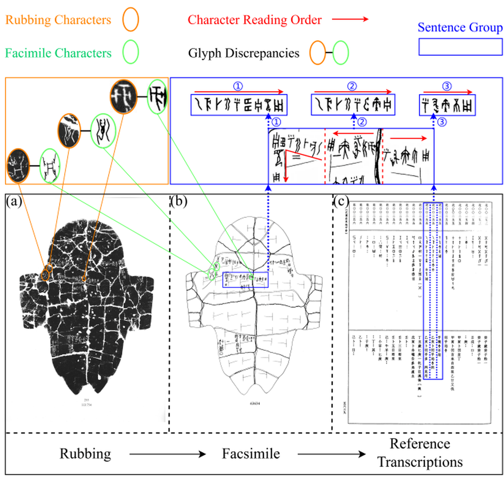

# Oracle Bone Inscriptions Multi-modal Dataset (OBIMD)

## Dataset Overview

The Oracle Bone Inscriptions Multi-modal Dataset (OBIMD) is the first large-scale corpus providing pixel-aligned rubbings and facsimiles, character-level annotations, and sentence-level transcriptions and reading sequences for oracle bone inscription (OBI) research. This dataset enables multi-modal learning across visual, structural, and linguistic dimensions, laying the foundation for end-to-end OBI recognition and interpretation.


## Dataset Statistics

- Total OBI images: 10,077 across five Shang Dynasty phases
- Annotated characters: 93,652
- Missing character positions: 21,667 (due to fragmentation)
- Sentences: 21,941 syntactically validated
- Non-sentential elements: 4,192

## Data Structure

The dataset follows a three-level hierarchy:

1. Image-level: Contains rubbing and facsimile pairs
2. Sentence-level: Groups characters into meaningful units
3. Character-level: Detailed annotations for each character


## Data Fields

|Field Name|Description|Example|
|Facsimile|Path to facsimile image|/DXData/moben_6327/h00002.jpg|
|Rubbing|Path to rubbing image|/DXData/tapian_10000/h00002.jpg|
|RubbingName|Short identifier|H2|
|GroupCategory|Sentence type|InscriptionSentence1|
|Position|Bounding box (x,y,w,h)|558,581,80,218|
|OrderNumber|Character order in sentence|5|
|Label|Main character label|xkubtjk815|
|SubLabel|Secondary label|xkubtjk815|
|SeatFont|Placeholder indicator|0|
|Mark|Special marker|-1|

## Data Modalities

1. Rubbing images: Original scanned images of oracle bones
2. Facsimile images: Expert reconstructions aligned with rubbings
3. Character annotations: Bounding boxes and classifications
4. Sentence groupings: Semantic organization of characters
5. Reading sequences: Order of characters within sentences


## Usage Notes

The dataset is designed to support various research tasks:

- Character detection and recognition
- Sentence-level character clustering
- Character reordering within sentences
- Multi-modal analysis (rubbing vs. facsimile)

## Citation

If you use this dataset in your research, please cite:

<!-- ```bibtex
@article{li2024obimd,
  title={Oracle Bone Inscriptions Multi-modal Dataset},
  author={Li, Bang and Luo, Donghao and Liang, Yujie and others},
  journal={arXiv preprint arXiv:2407.03900},
  year={2024},
  url={https://doi.org/10.48550/arXiv.2407.03900}
}
```
## License
The dataset is released for academic research purposes only. Commercial use requires special permission from the authors. -->